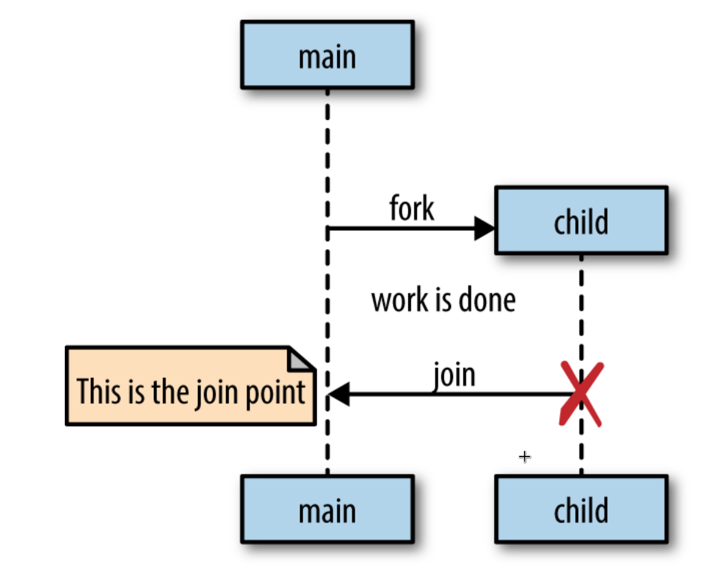
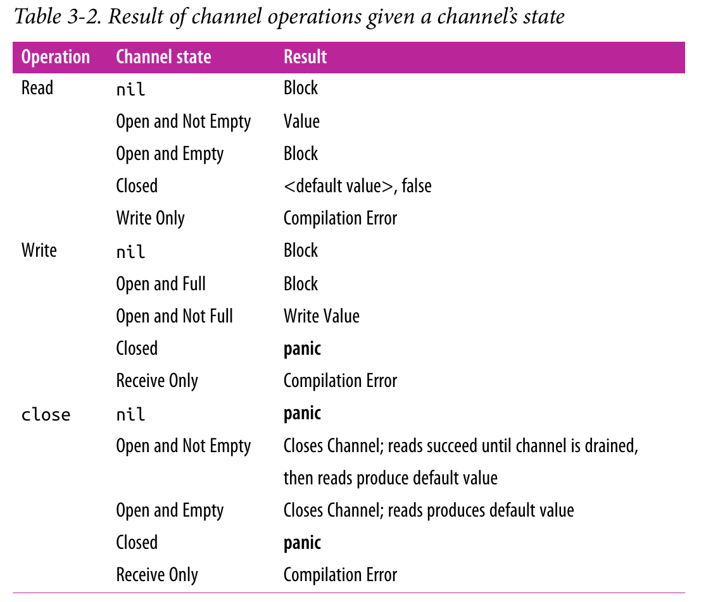

# Go 并发元件

## 分叉-汇合模型 Fork-Join

- 程序执行过程中，**父线程**可以分叉出一个与其并发执行的**子线程**
- **汇聚点**: 子线程从独立执行到汇合回父线程的时间点



## 分叉-汇合模型

```go
sayHello := func() {
  fmt.Println("hello" )
}
go sayHello()
// continue doing other things
```

以上程序的输出结果是未定的。因为 go 协程由 Go 的运行时创建和调度，`sayHello`协程没能通过合适的汇聚点和主协程进行汇合，因此，如果被调度之前主协程已退出，`sayHello`就无法获得执行的机会

**正确设置的汇聚点**能确保程序正确性并消除潜在的**竞态**

为上述程序设置正确的汇聚点，`sayHello`必须和主协程同步，使自己能在主协程退出之前与其汇合解决方案之一如下

```go
var wg sync. WaitGroup
sayHello := func() {
defer wg. Done()
  fmt. Println("hello" )
}
wg.Add(1)
go sayHello()
wg.Wait()  // 汇聚点

// 输出:
// hello
```

## `sync`包

`sync`包维护着用于同步底层内存访问的元件，包括

- `WaitGroup`
- `Mutex`和`RWMutex`
- `Cond`
- `Once`
- `Pool`

### `WaitGroup`

#### p1

**用途**: 等待一批并发操作结束，操作的结果不是关心的重点或者能够通过其他途径收集

```go
var wg sync.WaitGroup

wg.Add(1)
go func() {
  defer wg.Done()
  fmt.Println("1st goroutine sleeping..." )
  time.Sleep(1)
}()

wg.Add(1)
go func() {
  defer wg.Done()
  fmt.Println("2nd goroutine sleeping..." )
  time.Sleep(2)
}()

wg.Wait()
fmt.Println("All goroutines complete." )

// 输出:
// 2nd goroutine sleeping...
// 1st goroutine sleeping...
// All goroutines complete.
```

#### p2

`WaitGroup`可看作一个线程安全的计数器

- 通过`Add(x)`加上特定数`x`
- 通过`Done()`使其减 1
- `Wait()`使其一直阻塞直至计数器置零

> `Add()`需要在`WaitGroup`追踪的协程之外(一般使主协程)调用，否则将引入**竞态**

### `Mutex`和`RWMutex`

#### p1

`Mutex`是`Mutual Exclusion`的缩写

**用途**: 保护程序的**关键区域**--需要**排他地**存取共享资源的程序片段

**`Mutex`和`RWMutex`要求开发者必须以特定的方式访问内存以保证数据的同步**

## p2-示例

```go
var count int
var lock sync.Mutex

increment := func() {
  lock.Lock()
  defer lock.Unlock()
  count++
  fmt.Printf("Incrementing: %d\n", count)
}
decrement := func() {
  lock.Lock() // 请求对关键区域--count变量的存取
  defer lock.Unlock()  // 放弃对关键区域的排他存取权利
  count--
  fmt.Printf("Decrementing: %d\n", count)
}

// Increment
var arithmetic sync.WaitGroup
for i := 0; i <= 5; i++ {
  arithmetic.Add(1)
  go func() {
    defer arithmetic.Done()
    increment()
  }()
}

// Decrement
for i := 0; i <= 5; i++ {
  arithmetic.Add(1)
  go func() {
    defer arithmetic.Done()
    decrement()
  }()
}
arithmetic.Wait()
fmt.Println("Arithmetic complete.")

// 输出:
// Decrementing: -1
// Incrementing: 0
// Incrementing: 1
// Incrementing: 2
// Incrementing: 3
// Incrementing: 4
// Incrementing: 5
// Decrementing: 4
// Decrementing: 3
// Decrementing: 2
// Decrementing: 1
// Decrementing: 0
// Arithmetic complete.
```

#### page--注意事项

- 确保每个锁`m`的`Lock()`调用之后必有配对的`defer m.UnLock()`语句
- 关键区域的进出代价是昂贵的

#### page--读写锁`RWMutex`

**在写锁未被锁定之前**，读写锁能够满足任意共存的读锁请求

```go
producer := func(wg *sync.WaitGroup, l sync.Locker) {
  defer wg.Done()
  for i := 5; i > 0; i-- {
    l.Lock()
    l.Unlock()
    time.Sleep(1)
  }
}

observer := func(wg *sync.WaitGroup, l sync.Locker) {
  defer wg.Done()
  l.Lock()
  defer l.Unlock()
}

test := func(count int, mutex, rwMutex sync.Locker) time.Duration {
  var wg sync.WaitGroup
  wg.Add(count + 1)
  beginTestTime := time.Now()
  go producer(&wg, mutex)
  for i := count; i > 0; i-- {
    go observer(&wg, rwMutex)
  }
  wg.Wait()
  return time.Since(beginTestTime)
}

tw := tabwriter.NewWriter(os.Stdout, 0, 1, 2, ' ', 0)
defer tw.Flush()

var m sync.RWMutex
fmt.Fprintf(tw, "Readers\tRWMutex\tMutex\n")
for i := 0; i < 20; i++ {
  count := int(math.Pow(2, float64(i)))
  fmt.Fprintf(
    tw,
    "%d\t%v\t%v\n",
    count,
    test(count, &m, m.RLocker()),
    test(count, &m, &m),
  )
}

// 输出:
// Readers  RWMutex       Mutex
// 1        32.87µs       5.541µs
// 2        19.603µs      5.439µs
// 4        76.62µs       15.886µs
// 8        20.201µs      26.892µs
// 16       51.558µs      50.657µs
// 32       61.313µs      34.999µs
// 64       79.628µs      54.763µs
// 128      96.749µs      118.701µs
// 256      75.414µs      89.375µs
// 512      142.882µs     114.705µs
// 1024     239.471µs     289.861µs
// 2048     540.809µs     479.173µs
// 4096     4.982512ms    827.095µs
// 8192     2.09599ms     1.790277ms
// 16384    4.47045ms     3.820926ms
// 32768    7.911863ms    7.163938ms
// 65536    15.689641ms   14.66057ms
// 131072   31.016011ms   28.674835ms
// 262144   62.493129ms   56.609731ms
// 524288   121.927969ms  113.786247ms
```

结论：性能提升并不明显

### `Cond`

#### page

**用途**: 协程用于等待或通知特定事件发生的中心

这里的事件只是在两个或更多协程之间传递事件发生的事实本身，无法承载其他信息

#### 等待事件通知的用例

##### 初级用法 1: 无限占用 CPU 内核的循环

```go
for conditionTrue() == false {
}
```

##### 初级用法 2: 利用主动睡眠提供可被挂起的执行点

```go
for conditionTrue() == false {
  time. Sleep(1*time.Millisecond)
}
```

问题: 效率不高，而且难以准确设置睡眠的时长：太长降低性能，太短消耗太多 CPU 时间

##### 推荐用法

```go
c := sync.NewCond(&sync.Mutex{})

c.L.Lock()
for conditionTrue() == false {
  c.Wait()
}
c.L.Unlock()
```

- `Wait()`促使协程进入阻塞状态，挂起当前协程，为其他协程腾出在系统级线程执行的机会
- `Wait()`内部执行过程会先调用所绑定锁的`Unlock()`，而在收到需要的信号后退出执行前再次执行`Lock()`重新获得对锁的控制权

##### 示例

```go
c := sync.NewCond(&sync.Mutex{})    // 创建一个`Cond`
queue := make([]interface{}, 0, 10) // 模拟一个容量为10的队列

removeFromQueue := func(delay time.Duration) {
  time.Sleep(delay)
  c.L.Lock()        // 再次进入关键区域
  queue = queue[1:] // 消费一个数据
  fmt.Println("Removed from queue")
  c.L.Unlock() // 消费完之后释放对关键区域的排他权
  c.Signal()   // 发出有新事件的信号
}

for i := 0; i < 10; i++ {
  c.L.Lock()            // 进入关键区域
  for len(queue) == 2 { // 检查信号通知的事件是否就是等待的条件
    c.Wait() // 等待信号通知
  }
  fmt.Println("Adding to queue")
  queue = append(queue, struct{}{})
  go removeFromQueue(1 * time.Second) // 新起协程用于从队列消费数据
  c.L.Unlock()                        // 不要忘记释放关键区域的排他权
}

// 输出:
// Adding to queue
// Adding to queue
// Removed from queue
// Adding to queue
// Removed from queue
// Adding to queue
// Removed from queue
// Adding to queue
// Removed from queue
// Adding to queue
// Removed from queue
// Adding to queue
// Removed from queue
// Adding to queue
// Removed from queue
// Adding to queue
// Removed from queue
// Adding to queue
```

> 以上输出结果也是不确定的，前 3 行也可能是

```bash
Adding to queue
Removed from queue
Adding to queue
```

##### `Signal`和`Broadcast`

- Go 运行时用于队列(先进先出)维护等待信号的协程
- `Signal()`调用后，Go 运行时只会通知等待最久的那个协程并将其出列
- `Broadcast()`的调用则会(逐一?并发?)通知所有等待的协程
- `Cond`的性能要比`channel`的高

##### `Broadcast`示例

用于通道`channel`实现比较麻烦而`Cond`则相对容易的按钮点击事件通知示例

```go
type Button struct {
  Clicked *sync.Cond
}
button := Button{Clicked: sync.NewCond(&sync.Mutex{})}

subscribe := func(c *sync.Cond, fn func()) {
  var goroutineRunning sync.WaitGroup
  goroutineRunning.Add(1)
  go func() {
    goroutineRunning.Done()
    c.L.Lock()
    defer c.L.Unlock()
    c.Wait()
    fn()
  }()
  goroutineRunning.Wait()
}

var clickRegistered sync.WaitGroup

clickRegistered.Add(3)
subscribe(button.Clicked, func() {
  fmt.Println("Maximizing window.")
  clickRegistered.Done()
})
subscribe(button.Clicked, func() {
  fmt.Println("Displaying annoying dialog box!")
  clickRegistered.Done()
})
subscribe(button.Clicked, func() {
  fmt.Println("Mouse clicked.")
  clickRegistered.Done()
})

button.Clicked.Broadcast()
clickRegistered.Wait()

// 输出:
// Mouse clicked.
// Maximizing window.
// Displaying annoying dialog box!
```

### `Once`

**用途**: 用于确保某个操作最多只被执行一次

```go
var count int
increment := func() {
  count++
}

var once sync.Once

var increments sync.WaitGroup
increments.Add(100)
for i := 0; i < 100; i++ {
  go func() {
    defer increments.Done()
    once.Do(increment)
  }()
}

increments.Wait()
fmt.Printf("Count is %d\n", count)

// 输出:
// Count is 1
```

#### 注意事项

- `Once`确保的目标操作是自己的`Do()`函数的回调函数
- `Once`内部使用了锁，在回调函数调用前请求锁，而在调用返回前释放锁，需要留意不同回调函数之间的依赖性，避免死锁

```go
var onceA, onceB sync. Once
var initB func()
initA := func() { onceB. Do(initB) }
initB = func() { onceA. Do(initA) }

onceA. Do(initA)
```

### 池`Pool`

**用途**: 池模式创建并导出特定数目或一批资源以被第三方使用

3 个基本方法

- `New`: 创建资源实例
- `Get`： 调用时，如果池有可用的实例，则将其直接返回给请求方，否则调用`New`方法实时创建一个然后将其返回给请求方
- `Put`: 将服务完毕的实例放回池缓存以被其他进程使用

实例

```go
myPool := &sync.Pool{
  New: func() interface{} {
    fmt.Println("Creating new instance.")
    return struct{}{}
  },
}

myPool.Get()
instance := myPool.Get()
myPool.Put(instance)
myPool.Get()

// 输出:
// Creating new instance.
// Creating new instance.
```

#### page: 使用池缓存资源以节省内存空间

在没有池作为缓存的请况下，以下程序需要的内存空间要大于 4KB

```go
var numCalcsCreated int
calcPool := &sync.Pool{
  New: func() interface{} {
    numCalcsCreated += 1
    mem := make([]byte, 1024)
    return &mem
  },
}

// Seed the pool with 4KB
calcPool.Put(calcPool.New())
calcPool.Put(calcPool.New())
calcPool.Put(calcPool.New())
calcPool.Put(calcPool.New())

const numWorkers = 1024 * 1024
var wg sync.WaitGroup
wg.Add(numWorkers)
for i := numWorkers; i > 0; i-- {
  go func() {
    defer wg.Done()
    mem := calcPool.Get().(*[]byte)
    defer calcPool.Put(mem)
    // Assume something interesting, but quick is being done with
    // this memory.
  }()
}

wg.Wait()
fmt.Printf("%d calculators were created.\n", numCalcsCreated)

// 输出:
// 4 calculators were created.
```

#### 用途: 预存一批能够快速响应(初始化比较漫长)的服务提供方

##### 模拟一个服务提供方

```go
func connectToService() interface{} {
	time.Sleep(1 * time.Second)
	return struct{}{}
}
```

##### 没有使用池预存对象的方式

```go
var daemonStarted *sync.WaitGroup

func connectToService() interface{} {
	time.Sleep(1 * time.Second)
	return struct{}{}
}

func startNetworkDaemon() *sync.WaitGroup {
	var wg sync.WaitGroup
	wg.Add(1)

	go func() {
		server, err := net.Listen("tcp", "localhost:8080")
		if err != nil {
			log.Fatalf("cannot listen: %v", err)
		}
		defer server.Close()

		wg.Done()
		for {
			conn, err := server.Accept()
			if err != nil {
				log.Printf("cannot accept connection: %v", err)
				continue
			}
			connectToService()
			fmt.Fprintln(conn, "")
			conn.Close()
		}
	}()
	return &wg
}

func BenchmarkNetworkRequest(b *testing.B) {

	b.ResetTimer()
	for i := 0; i < b.N; i++ {
		conn, err := net.Dial("tcp", "localhost:8080")
		if err != nil {
			b.Fatalf("cannot dial host: %v", err)
		}
		if _, err := ioutil.ReadAll(conn); err != nil {
			b.Fatalf("cannot read: %v", err)
		}
		conn.Close()
	}
	b.StopTimer()
}

func init() {
  // daemonStarted放在这里避免因BenchmarkNetworkRequest报端口被占用的错误
	daemonStarted = startNetworkDaemon()
	daemonStarted.Wait()
}

// 输出:
// BenchmarkNetworkRequest-4    	      10	1000999296 ns/op
```

##### 使用池缓存的方式

```go
var daemonStarted2 *sync.WaitGroup

func warmServiceConnCache() *sync.Pool {
	p := &sync.Pool{
		New: connectToService,
	}
	for i := 0; i < 10; i++ {
		p.Put(p.New())
	}
	return p
}

func startNetworkDaemon2() *sync.WaitGroup {
	var wg sync.WaitGroup
	wg.Add(1)
	go func() {
		connPool := warmServiceConnCache()

		server, err := net.Listen("tcp", "localhost:8082")
		if err != nil {
			log.Fatalf("cannot listen: %v", err)
		}
		defer server.Close()

		wg.Done()

		for {
			conn, err := server.Accept()
			if err != nil {
				log.Printf("cannot accept connection: %v", err)
				continue
			}
			svcConn := connPool.Get()
			fmt.Fprintln(conn, "")
			connPool.Put(svcConn)
			conn.Close()
		}
	}()
	return &wg
}

func BenchmarkNetworkRequest2(b *testing.B) {
	b.ResetTimer()
	for i := 0; i < b.N; i++ {
		conn, err := net.Dial("tcp", "localhost:8082")
		if err != nil {
			b.Fatalf("cannot dial host: %v", err)
		}
		if _, err := ioutil.ReadAll(conn); err != nil {
			b.Fatalf("cannot read: %v", err)
		}
		conn.Close()
	}
}

func init() {
  // daemonStarted2放在这里避免因BenchmarkNetworkRequest2报端口被占用的错误
	daemonStarted2 = startNetworkDaemon2()
	daemonStarted2.Wait()
}


// 输出:
// BenchmarkNetworkRequest2-4   	    3000	   3414956 ns/op
```

现象：加快了近 1000 倍

#### 注意事项

##### 适用场景

为并发的进程提供对象，这些对象

- 在初始化后很快就被抛弃
- 或创建会对内存影响不小

##### 不适用的场景

进程需要的服务对象不是同态的--部分时间会被浪费在对象的类型转换上

#### page--结论

- 初始化`Pool`时，创建一个线程安全的`New`成员
- 不要对`Get()`返回的对象状态做任何前提假设
- 不要忘记利用`Put()`将服务对象再次缓存以重用
- 池中对象应基本同态，即类型相同

## 通道 Channel

**功能**: 以线程安全的方式实现不同协程之间的通信

通道在声明时指定其数据流向

- 读写: 默认，例如，`xStream := make(chan int)`
- 只读: 将`<-`箭头放在`chan`关键字的左边，例如，`yStream := make(<-chan int)`
- 只写: 将`<-`箭头放在`chan`关键字的右边，例如，`zStream := make(chan<- int)`

> go 会在必要时隐式地将单向通道(只读/只写)转为双向通道(读写)

#### page--类型、数据传递

- 通道传递的数据类型可以被指定
- 对于一个可读通道`c`，可以利用表达式`c <- x`将值`x`放到通道里
- 对于一个可写通道`c`，可以利用表达式`y <- c`从通道里取出值`y`

```go
//stringStream := make(chan string)
//go func() {
//  stringStream <- "Hello channels!"
//}()
//fmt.Println(<-stringStream)

// 输出:
// Hello channels!
```

#### page--注意事项

以下情况会导致编译错误

- 对只读通道的写操作

```go
readStream := make(<- chan interface{})
readStream <- struct{}{}

// 输出:
// invalid operation: readStream <- struct {} literal (send to receive-only type <-chan interface {})
```

- 对只写通道的读操作

```go
writeStream := make(chan<- interface{})
<- writeStream

// 输出:
// invalid operation: <-writeStream (receive from send-only type chan<- interface {})
```

#### 阻塞性

通道的阻塞性是指

- 任何尝试向容量已满的通道发送数据的协程会等待直至通道有剩余空间
- 任何尝试向空通道读数据的协程都会等待直至有一个值进入通道

#### 读操作

两种方式

- 只返回一个值: 从通道传输下来的数据
- 返回一个值`x`和一个布尔值`closed`
  - 从通道传输下来的数据
  - `closed=false`表示`x`是由于通道已关闭其容量为空而返回的所声明类型的默认值
  - `closed=false`则表示`x`是从别处写入通道的值

```go
stringStream := make(chan string)
go func() {
  stringStream <- "Hello channels!"
}()

salutation, ok := <-stringStream
fmt.Printf("(%v): %v", ok, salutation)

// 输出:
// (true): Hello channels!
```

#### 通道的关闭

- `close(c)`函数调用可关闭通道`c`
- 可读通道满足无限地读请求(即使通道已被关闭)

#### 设计模式

##### `for...range`遍历

`range`关键字和`for`关键字组合可以通道作为实参，并在通道关闭时自动跳出循环

```go
intStream := make(chan int)

go func() {
  defer close(intStream)
  for i := 1; i <= 5; i++ {
    intStream <- i
  }
}()

for integer := range intStream {
  fmt.Printf("%v ", integer)
}

// 输出:
// 1 2 3 4 5
```

##### 以通道的关闭为信号通知多个协程

```go
begin := make(chan interface{})

var wg sync.WaitGroup
for i := 0; i < 5; i++ {
  wg.Add(1)
  go func(i int) {
    defer wg.Done()
    <-begin
    fmt.Printf("%v has begun\n", i)
  }(i)
}

fmt.Println("Unblocking goroutines...")
close(begin)
wg.Wait()

// Unblocking goroutines...
// 1 has begun
// 0 has begun
// 3 has begun
// 4 has begun
// 2 has begun
```

#### 容量

通道根据容量可划分为 2 种类型：非缓存型和缓存型

缓存型

- 通道在初始化时被赋予大于 0 的容量
- 给定容量为`n`，对通道`c`可同时支持`n`个写操作
- 可作为一个内存型队列实现并发进程间的通信
- 通道为空且有挂起的等待协程时，新值的传入会绕过通道直接传给等待协程
- 这类通道容易导致过早优化问题和隐藏死锁问题

声明时不指定容量或指定容量为 0 的通道是非缓存型通道

通道的**满**和**空**都是相对与通道的容量而言的

##### 缓存型通道样例

```go
var stdoutBuff bytes.Buffer
defer stdoutBuff.WriteTo(os.Stdout)

intStream := make(chan int, 4)
go func() {
  defer close(intStream)
  defer fmt.Fprintln(&stdoutBuff, "Producer Done.")
  for i := 0; i < 5; i++ {
    fmt.Fprintf(&stdoutBuff, "Sending: %d\n", i)
    intStream <- i
  }
}()

for integer := range intStream {
  fmt.Fprintf(&stdoutBuff, "Received %v.\n", integer)
}

// 输出(顺序也是不定的):
// Sending: 0
// Sending: 1
// Sending: 2
// Sending: 3
// Sending: 4
// Producer Done.
// Received 0.
// Received 1.
// Received 2.
// Received 3.
// Received 4.
```

在预知通道需要支持的并发写操作次数`n`时，容量大小为`n`的缓存型通道可以使得写操作尽可能快地执行

#### 未初始化的`nil`通道

给定`nil`通道`c`

- 对`c`的读操作会阻塞进程(尽管并不一定会导致死锁??)

```bash
fatal error: all goroutines are asleep - deadlock!
```

- 对`c`的写操作也会阻塞进程

```bash
fatal error: all goroutines are asleep - deadlock!
```

- 关闭`c`会触发`panic`

```bash
panic: close of nil channel
```

#### 不同操作的后果



由表可知，

- 阻塞协程的操作有 3 种
- 导致协程恐慌的操作有 3 种

### 上下文

通道的正确使用需要有合理的上下文环境，而为通道赋予正确的所有权协助创造这种环境

通道的所有权应该属于负责初始化、写入数据和关闭通道的协程

通过这种规则限定

1. 所有者持有对通道的写权限
2. 接收方则对通道只有读权限

#### 通道所有者

应负责

1. 初始化通道
2. 执行写操作或将通道所有权转移给其他协程
3. 关闭通道
4. 将以上 3 项封装为一个只读通道暴露给接收者

#### 通道接收者

只需关心 2 项内容

- 监听通道的关闭
- 负责处理任何情况下的阻塞

#### 基于通道实现的生产者--消费者样例

```go
chanOwner := func() <-chan int {
  resultStream := make(chan int, 5)
  go func() {
    defer close(resultStream)
    for i := 0; i <= 5; i++ {
      resultStream <- i
    }
  }()
  return resultStream
}

resultStream := chanOwner()
for result := range resultStream {
  fmt.Printf("Received: %d\n", result)
}
fmt.Println("Done receiving!")

// 输出:
// Received: 0
// Received: 1
// Received: 2
// Received: 3
// Received: 4
// Received: 5
// Done receiving!
```

## `select`语句

`select`负责绑定通道到

- 局部的类型或单个函数
- 全局范围内多个系统组件

借助`select`语句安全地利用通道实现诸如**取消**、**超时**、**等待**和**默认值**等概念

超时样例

```go
var c <-chan int
select {
case <-c:
case <-time.After(1 * time.Second):
  fmt.Println("Timed out.")
}

// 输出:
// Timed out.
```

### `case`检查的公平性

不同于`switch`语句，对于`select`语句

- `case`子句不会线性地从上往下执行
- 在没有任何满足条件的`case`子块时会一直阻塞
- Go 运行时会随机均匀地选择非阻塞的`case`子句执行

`case`语句中的通道所有读写操作会被同时检查是否已被满足

- 读操作的可读通道非空，或通道已关闭
- 写操作的可写通道非满

```go
c1 := make(chan interface{})
close(c1)
c2 := make(chan interface{})
close(c2)

var c1Count, c2Count int
for i := 1000; i >= 0; i-- {
  select {
  case <-c1:
    c1Count++
  case <-c2:
    c2Count++
  }
}

fmt.Printf("c1Count: %d\nc2Count: %d\n", c1Count, c2Count)

// 输出
// c1Count: 495
// c2Count: 506
```

### `default`默认子句

`default`子句负责执行其他`case`子句都不满足时的操作

```go
start := time.Now()
var c1, c2 <-chan int
select {
case <-c1:
case <-c2:
default:
  fmt.Printf("In default after %v\n\n", time.Since(start))
}

// 输出:
// In default after 1.482µs
```

#### `default`执行默认操作

通常`default`子句会与`for-select`循环结合使用

其中一个用例为：利用`done`作为终止循环的信号，而`default`子句负责执行终止之前的常规任务

```go
done := make(chan interface{})
go func() {
  time.Sleep(5 * time.Second)
  close(done)
}()

workCounter := 0
loop:
for {
  select {
  case <-done:
    break loop
  default:
  }

  // Simulate work
  workCounter++
  time.Sleep(1 * time.Second)
}

fmt.Printf("Achieved %v cycles of work before signalled to stop.\n", workCounter)

// 输出
// Achieved 5 cycles of work before signalled to stop.
```

#### 空`select`语句

空`select`语句会用于阻塞
